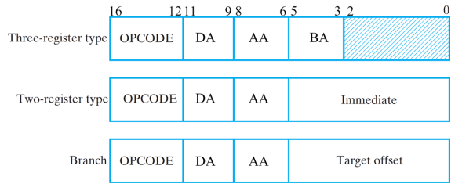
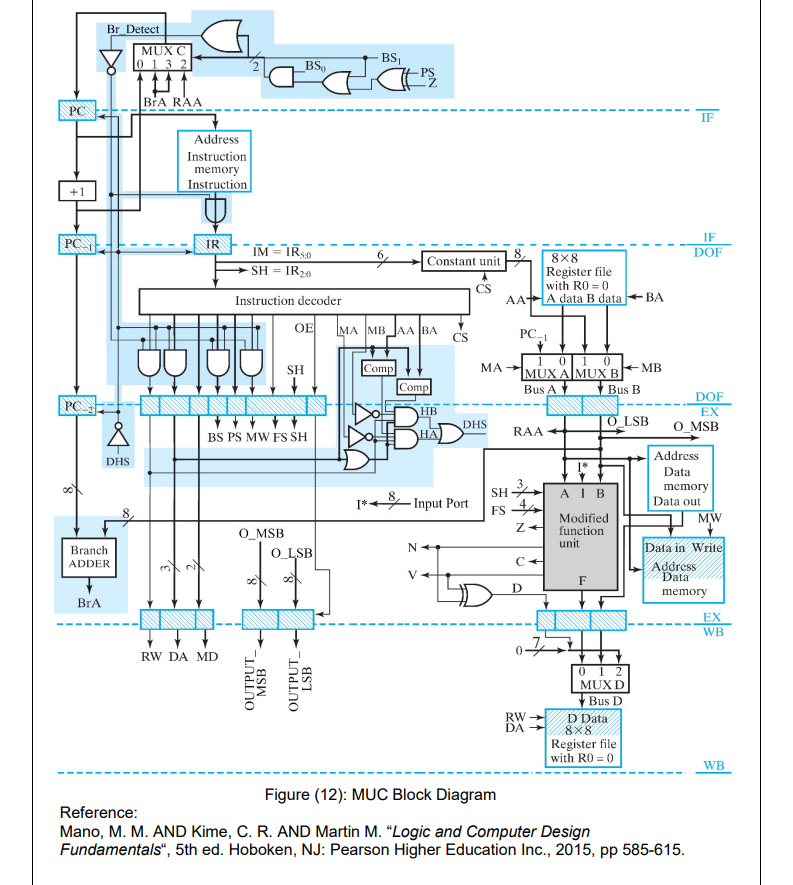
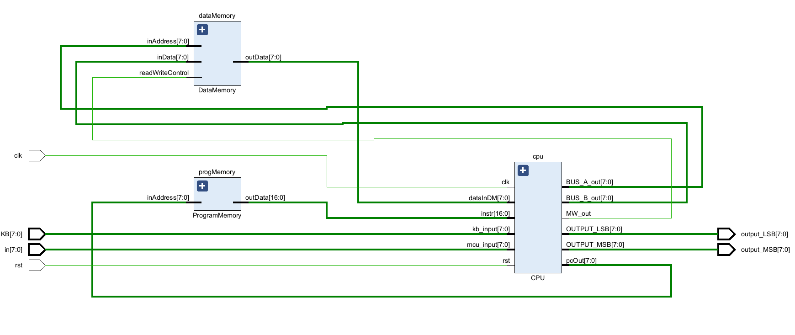
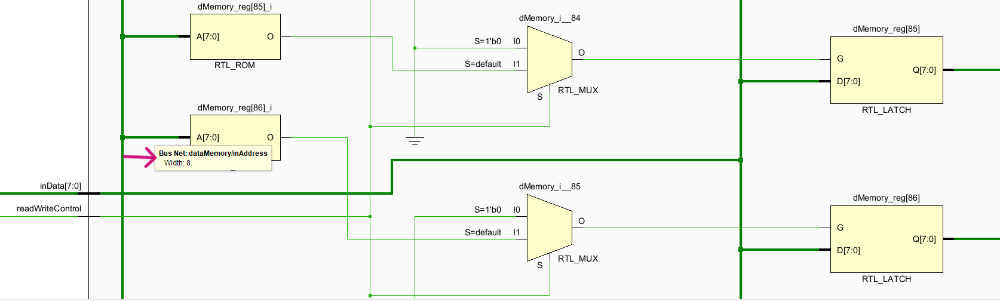
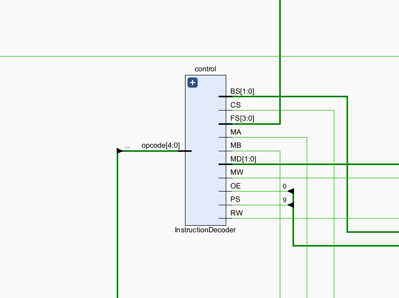
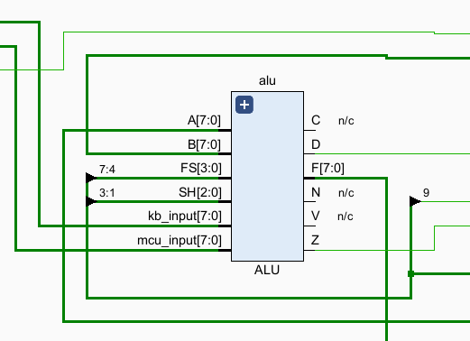
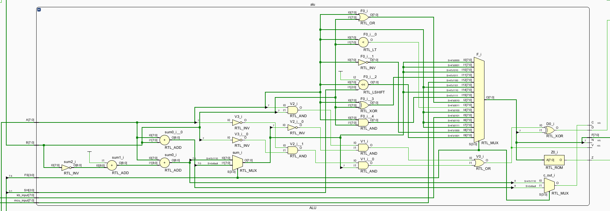
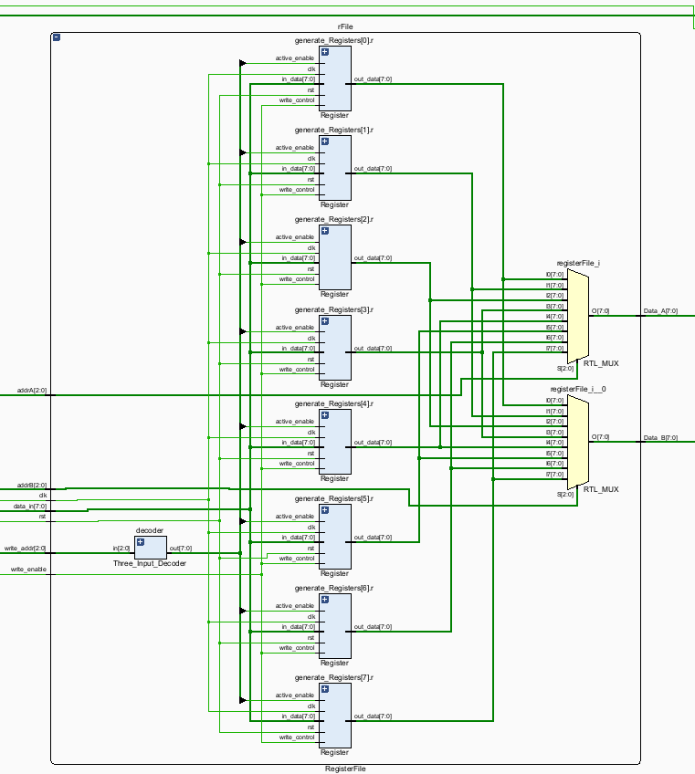
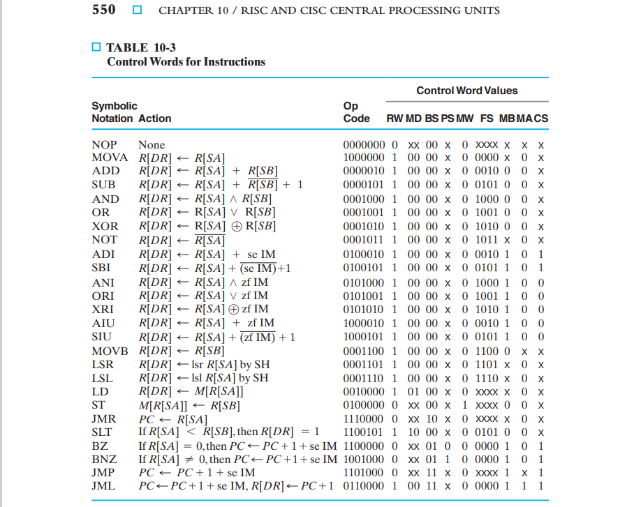

# RISCyMCU
RISCyMCU (RISCy or RM for short) is an 8-bit microcontroller unit 
equipped with a 4-stage pipelined CPU that supports data and control hazard detection.

## ISA Format
Note that 
- DA is the destination register.
- AA and BA are input registers.

## Architecture
Shown below is the source architecture for RISCy.
We explain our RTL implementation of this design next.

## RTL Implementation
RISCy comprises data and instruction memory modules and a CPU as shown below.

### Memory Modules
- The data memory module stores 256B via 256 latches each storing one byte.

- Instruction memory stores 256 17-bit instructions via a single ROM module.

### CPU
The CPU comprises the following modules: 
- Instruction Decoder
- ALU
- 3 Program Counters 
- Register File 
- Constant Unit (Sign Extension)
- Two 2-input MUXs
- One 3-input
- One 4-input MUX
- Branch detection circuitry
- Data Hazard detection circuitry
- 10 Pipeline Registers

#### Instruction Decoder
Also known as the control block, this module generates signals that control data flow across
every module within RISCy. It receives an operation code which determines the type of
control signals to generate.

#### ALU

A combinational circuit that performs arithmetic and logical computations. Note that:
- F: output
- C: carry
- N: bit indicating whether F is negative or not.
- V: bit indicating overflow
- Z: bit indicating whether F is zero or not.
- D: V xor N.

The internal circuitry of the ALU is shown below

#### Register File
A collection of eight 8-bit registers labeled R0 − R7. R0 is
permanently connected to zero and is not writable. The other registers, on the other hand, are
writable D flip-flops.

#### Branch Detection
This circuitry forces "bubbles" in the pipeline when a taken branch is detected. 
In particular, it works as follows:
- The state of the branch is calculated in the EX or third stage of the pipeline.
- After detecting a taken branch, the circuitry zeroes the state of the previous two pipeline stages, namely IF and DOF.
- The pipeline is stalled for two cycles as well.

Ensure to check the `Br_Detect` circuitry in [Architecture](#architecture) for a visual presentation.

#### Data Hazard Detection
This circuitry detects hazardous data dependency between instructions within the pipeline.
It works as follows:
- The data dependency is detected as `DHS` in the EX or third stage of the pipeline.
- If detected, the circuitry stalls the pipeline by one cycle.

Ensure to check the `DHS` circuitry in [Architecture](#architecture) for more information.
## Instructions
Instructions are 17 bits as shown in [ISA Format](#isa-format). All Opcodes are enumerated in `InstructionDecoder.v`.

### Supported instructions
- No Operation

#### Three-Register type
- OR
- Set if Less Than
- Add Immediate Unsigned
- Add Immediate
- Exclusive-OR Immediate
- Add
- Subtract Immediate Unsigned
- AND immediate.

#### Two-Register type
- Move A.
- Store
- Load
- Compliment (NOT)
- Logical Shift Left
- Output (Needs configuration with an FPGA).
- Input (Needs configuration with an FPGA).
- Input Keyboard (Needs configuration with an FPGA).

#### Branch
- Jump
- Branch If Zero     
- Jump Register 
- Branch if Nonzero  
- Jump and Link

### Instruction Layouts
Note the following acronyms:
- zf: zero fill
- se: sign extend
- SH: described in [Architecture](#architecture)

## Run
- Load your instruction to `ProgramMemory.v`
- Run a behavioral simulation of `MCU_testBench.v` to execute those instructions.

