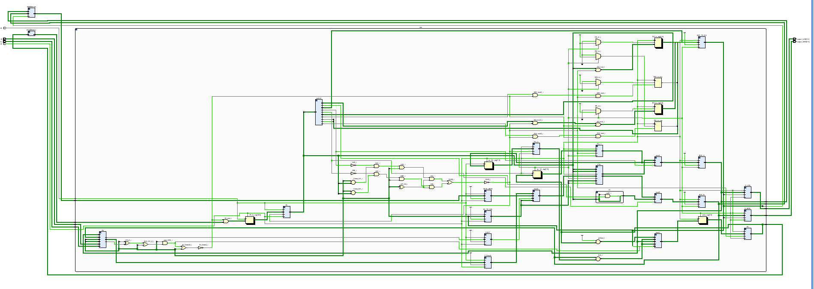

# RISCyMCU
RISCyMCU (RM for short) is an 8-bit microcontroller unit 
equipped with a 4-stage pipelined CPU that supports data and control hazard detection. 

# Run
- Load your instruction to `ProgramMemory.v` 
- Simulate `MCU_testBench.v` to execute those instructions.

## Instructions
The figures below are due to [Logic and Computer Design Fundamentals](https://www.amazon.com/Logic-Computer-Design-Fundamentals-5th/dp/0133760634)
by M.M. Mano, C.R. Kime and Tom Martin.

Instructions are 17 bits. All Opcodes are enumerated in `InstructionDecoder.v`.

`DA` stands for Destination Register.
`AA` & `BA` are input registers.

Supported instructions are:
- No Operation

#### Three-Register type
- OR
- Set if Less Than
- Add Immediate Unsigned
- Add Immediate
- Exclusive-OR Immediate
- Add
- Subtract Immediate Unsigned
- AND immediate.

#### Two-Register type
- Move A.
- Store
- Load
- Compliment (NOT)
- Logical Shift Left
- Output (Needs configuration with an FPGA).
- Input (Needs configuration with an FPGA).
- Input Keyboard (Needs configuration with an FPGA).

#### Branch
- Jump
- Branch If Zero     
- Jump Register 
- Branch if Nonzero  
- Jump and Link

## Architecture
Again, the figure below is due to M.M. Mano, C.R. Kime and Tom Martin.

# RTL Schematic
The schematic below is for the top-level of the MCU. More details to follow.

## CPU RTL Schematic
Apologies, but this unintelligible figure is the RTL schematic for the CPU. Quite a lot of nets, right?
We will do well to break down this behemoth soon in sections to follow.

